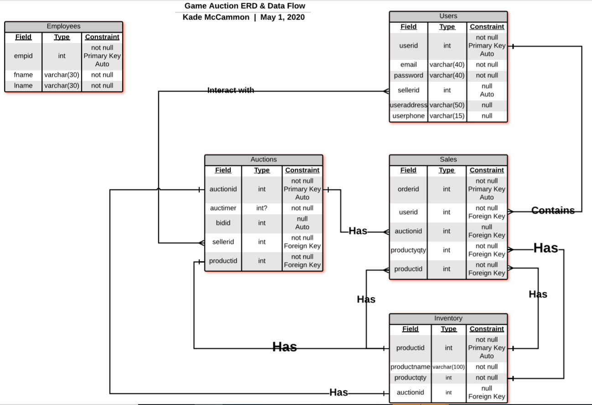

# Game Auction Data Base
## Physical Database Design


## Database Implementation (SQL Script)

```SQL
USE master;

IF DB_ID(N'GAMEAUCTION') IS NOT NULL DROP DATABASE GAMEAUCTION;

IF @@ERROR = 3702
   RAISERROR(N'Database cannot be dropped because there are still open connections.', 127, 127) WITH NOWAIT, LOG;

CREATE DATABASE GAMEAUCTION;
GO

USE GAMEAUCTION;
GO

CREATE SCHEMA HR AUTHORIZATION dbo;
GO
```
## Employees Table
```SQL

CREATE TABLE HR.Employees
(
  empid			INT				NOT NULL IDENTITY,
  fname         NVARCHAR(30)    NOT NULL,
  lname         NVARCHAR(30)    NOT NULL,
  CONSTRAINT PK_Employees PRIMARY KEY(empid)
  );
  ```
  ## Users Table
```SQL
CREATE TABLE Users
(
  userid	    INT             NOT NULL IDENTITY,
  fname         NVARCHAR(40)    NOT NULL,
  lname         NVARCHAR(40)    NOT NULL,
  email         NVARCHAR(40)    NOT NULL,
  password      NVARCHAR(40)    NOT NULL,
  useraddress   NVARCHAR(50)    NULL,
  userphone     NVARCHAR(15)    NULL,
  CONSTRAINT PK_Users PRIMARY KEY (userid)
  );
  ```
  ## Inventory Table
  ```SQL
CREATE TABLE Inventory
(
  productid     INT             NOT NULL IDENTITY,
  productname   NVARCHAR(100)   NOT NULL,
  productqty    INT             NOT NULL,
  CONSTRAINT PK_Inventory PRIMARY KEY(productid),
);
```
## Sales Table
```SQL
CREATE TABLE Sales
(
  orderid       INT             NOT NULL IDENTITY,
  userid        INT             NOT NULL,
  productid     INT				NOT NULL,
  CONSTRAINT PK_Sales PRIMARY KEY(orderid),
  CONSTRAINT FK_Sales_Users FOREIGN KEY(userid)
	REFERENCES dbo.Users(userid),
  CONSTRAINT FK_Sales_Inventory2 FOREIGN KEY(productid)
	REFERENCES dbo.Inventory(productid),
);
```
## Sellers Table 
```SQL
CREATE TABLE Sellers
(
  sellerid      INT             NOT NULL IDENTITY,
  userid        INT             NOT NULL,
  CONSTRAINT PK_Sellers PRIMARY KEY(sellerid),
  CONSTRAINT FK_Sellers_Users FOREIGN KEY(userid)
	REFERENCES dbo.Users(userid)
);
```
## Auctions Table
```SQL
CREATE TABLE Auctions
(
  auctionid     INT             NOT NULL IDENTITY, 
  bidid         INT             NULL ,
  sellerid      INT             NOT NULL,
  productid     INT             NOT NULL,
  CONSTRAINT PK_Auctions PRIMARY KEY(auctionid),
  CONSTRAINT FK_Auctions_Sellers FOREIGN KEY(sellerid)
	REFERENCES dbo.Sellers (sellerid),
  CONSTRAINT FK_Auctions_Inventory FOREIGN KEY(productid)
	REFERENCES dbo.Inventory(productid)
);
```
## Had to alter after creating due to error.
```SQL
ALTER TABLE dbo.Inventory
	ADD 
		auctionid INT NULL,
		CONSTRAINT FK_Inventory_Auctions FOREIGN KEY(auctionid)
			REFERENCES dbo.Auctions(auctionid);

ALTER TABLE dbo.Sales
	ADD
		auctionid     INT             NULL,
        productqty    INT             NOT NULL,
		CONSTRAINT FK_Sales_Auctions FOREIGN KEY(auctionid)
			REFERENCES dbo.Auctions(auctionid);
```
## Various Inserts
```SQL
INSERT INTO HR.Employees(fname, lname)
VALUES(N'Kade', N'McCammon'), ('John', N'Smith'), (N'Joe', N'Johnson');


INSERT INTO Dbo.Users(fname, lname, email, password)
VALUES(N'Jay', N'Johnson', N'jjohnson@hotmail.com', N'HelloWorld');

INSERT INTO Dbo.Users(fname, lname, email, password)
VALUES(N'Bob', N'Kraft', N'bobbykraft@gmail.com', N'PatriotsOwner1'),
      (N'Jerry', N'Jones', N'billionairejerry@aol.com', N'CeeDeeLamb');

INSERT INTO Dbo.Inventory(productname, productqty)
VALUES(N'Madden 21', 3), (N'The Witcher 3 Wild Hunt', 1), (N'Call of Duty: Modern Warfare', 4), (N'Assassins Creed Oddysey', 2);
```
